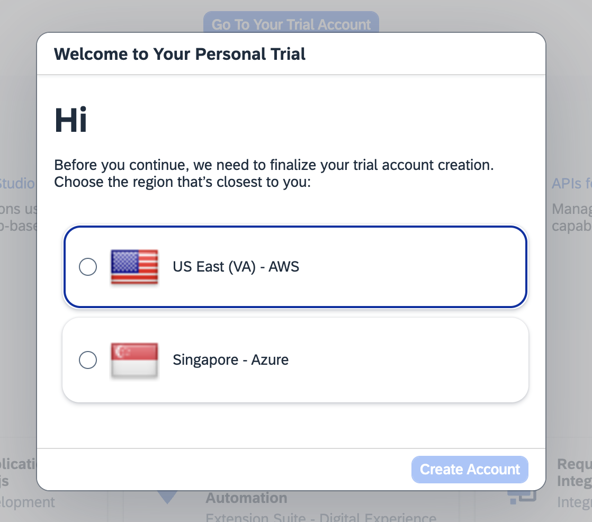
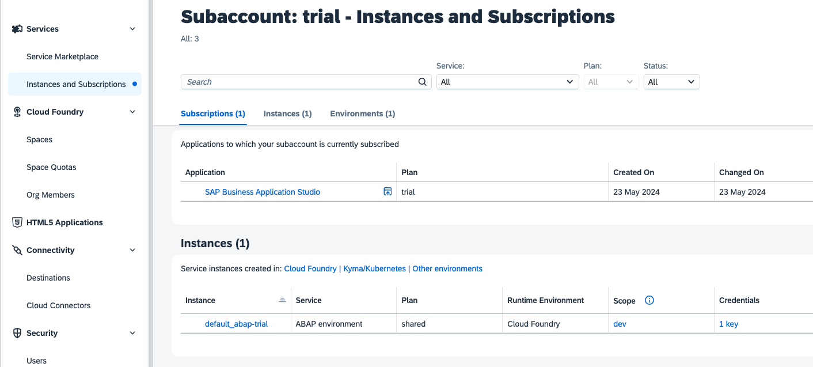

# Chapter 1.0 - Preparing the Development Environment

By the end of this chapter we will have prepared our development environment so that we can start developing our SAPUI5 adaptation project.

## Steps

[1. Prerequisites for SAPUI5 Adaptation Project](#prerequisites-for-sapui5-adaptation-project) 
[2. Prerequisites for Backend Integration](#prerequisites-for-backend-integration) 

### Prerequisites for SAPUI5 Adaptation Project

To be able to follow the instructions in this repository you need to fulfill the following requirements:

#### 1. Create a trial account on SAP BTP in US10

To create a trial account please follow [this tutorial](https://developers.sap.com/tutorials/hcp-create-trial-account.html).

> [!IMPORTANT]   
> Make sure you choose the option **US East (VA) - AWS**

#### 2. Create an SAP BTP ABAP Environment Trial User and Set Up you SAP Business Application Studio

Next you need to prepare your environment, use the corresponding tutorial [Create an SAP BTP ABAP Environment Trial User](https://developers.sap.com/tutorials/abap-environment-trial-onboarding.html).

And the best thing? You only need this one booster since it will create both a SAP BTP, ABAP environment as well as set up your SAP Business Application Studio.

Verify your successfull set up by navigating to your **Global Account** > **Trial Subaccount** > **Services** > **Instances and Subscriptions** tab in your SAP BTP cockpit. It should contain both a SAP Business Application Studio subscription as well as an instance of the ABAP environment, like this:

### Prerequisites for Backend Integration

To be able to deploy your SAPUI5 adaptation project to the SAP BTP, ABAP environment and consume your application variant in the SAP Fiori Launchpad, corresponding to chapter 6, 7 and 8 of this repository, you need to fulfill the following requirements:

#### 1. Download ABAP Development Tools (ADT)

Download and install the latest ABAP Development Tools (ADT) by following the steps in this link [https://tools.hana.ondemand.com/#abap](https://tools.hana.ondemand.com/#abap)

#### 2. Connect your SAP BTP, ABAP environment with your ABAP Development Tools

In your ABAP Development Tools create an ABAP Cloud Project by following this tutorial: [Create an ABAP Cloud Project](https://developers.sap.com/tutorials/abap-environment-create-abap-cloud-project.html)

Continue to [Chapter 1.1 - Connect your SAP BAS with your SAP BTP ABAP environment with a destination](/chapters/1.1-create-destination//)
