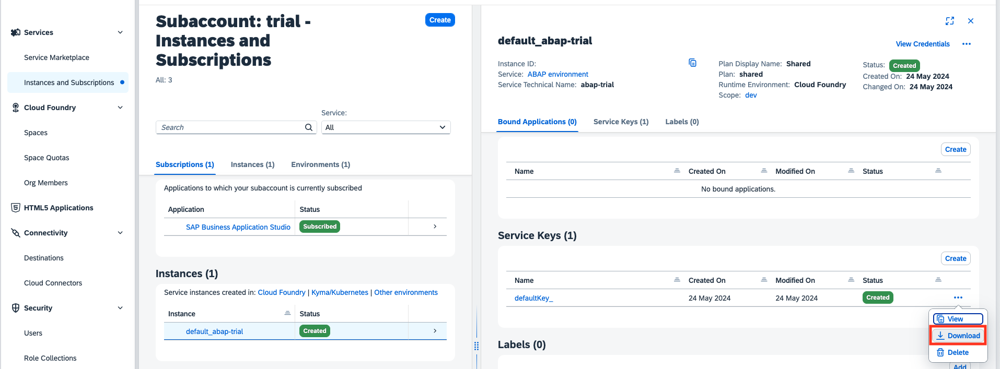
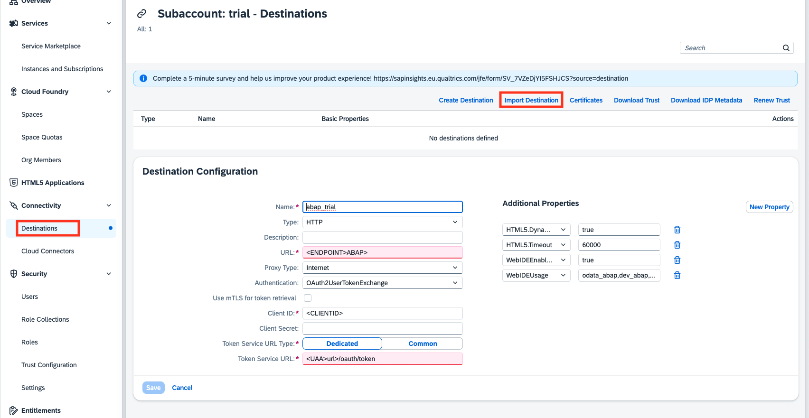
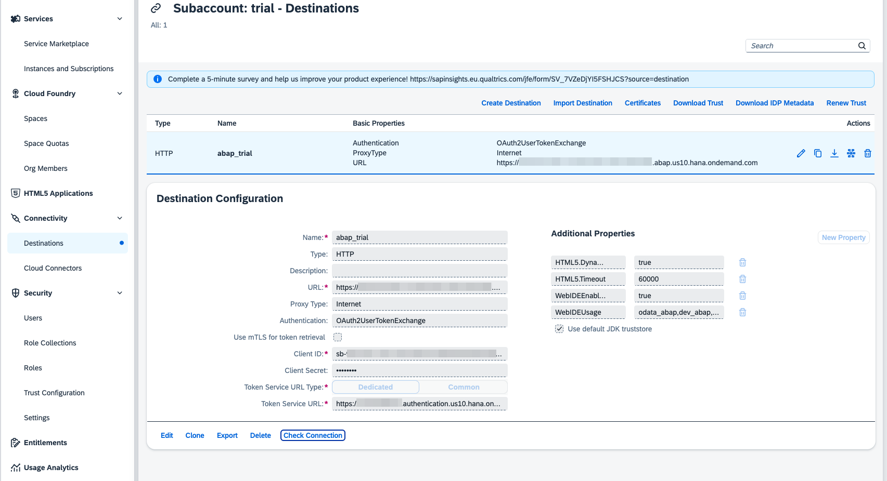

# 1.1 Create a Destination

To connect your SAP BTP, ABAP environment to you SAP Business Application you need to do one final step: Create a destination.

## 3.1 Get your service key

If you haven't saved your service key in one of the previous steps, navigate to your **Global Account** > **Trial Subaccount** > **Instances and Subcriptions** and select there ```default_abap-trial```.  On the right side scroll down to Service Keys, select ```defaultKey_..``` and select the option **Download**.



## 3.2 Import destination

Navigate to your **Global Account** > **Trial Subaccount** > **Connectivity** > **Desitnations** and click on the **Import Destination** button and select our prepare destination found in this repo under the current chapter: ```abap_trial```



Fill in your destination with the information from your service key.

```
URL: < endpoints/abap >
Client ID: < uua/clientid >
Client Secret: <uaa/clientsecret>
Token Service URL: <uaa/url> + "/oauth/token"
```

Click on save and verify your connection by clicking on the appearing "Check Connection" button.



Now you're ready to start your SAP Business Application Studio!


Continue to [Chapter 2.0 - Open and Create a Dev Space in your SAP Business Application Studio](/chapters/1.2-open-BAS/)
