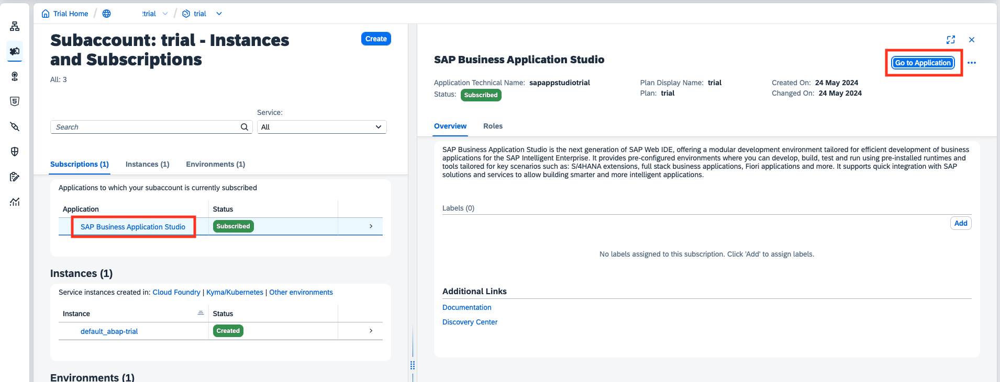

# Create a Dev Space in your SAP Business Application Studio

### 1. Open your SAP Business Application Studio

Navigate to your **Global Account** > **Trial Subaccount** > **Instances and Subcriptions** and either direcly click on the linked **SAP Business Application Studio** navigate to the Detail Page and click on the **Go to Application** button.




### 3. Create a dev space

Confirm the terms and conditions. On the appearing Business Application Studio screen click on "Create Dev Space" button.
Name your dev space according to your preferences. 
For this tutorial we select the "SAP Fiori" dev space, but theoretically you can choose any space that fits your need.


SAP Business Application Studio will create the space for you. Once it is ```RUNNING``` open your dev space.


Now you're ready to get started with the SAPUI5 adaptation project!

But first, if you want to deploy your adaptation project to the SAP BTP, ABAP environment and include it into the SAP Fiori Launchpad, you need to create a package and a transport first. 
You can also skip this part and only play around with the SAP Business Application Studio.

Continue to [Chapter 1.3 - Create a package and transport in ADT](/chapters/1.3-create-package-adt/)
