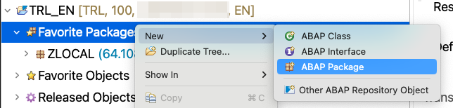

# Chapter 1.3 - Create a package and transport in ADT

If you want to follow this tutorial until the end (and especially including chapter 6 to 8) then you will need to create a package as well as a new transport.

To set up your ADT and your ABAP Cloud Project, please follow [chapter 1.0](/chapters/1.0-prepare-setup/) step 2 "Prerequisites for Backend Integration".

### Create a new package and a new transport in one wizard

In your ABAP Development tools, navigate to your Trial ABAP project and right click either on ZLOCAL and select **New** > **ABAP package**

Select a unique name starting with "Z" and select a unique identifier for your package.

On the next screen click on "Next".

And on the final screen select "Create a new request" and fill in the description and click on finish.

Note down the name of your package and the name of your transport. To find your newly created transport, navigate to the Transport Organizer at the bottom of your ADT open up the "Modifiable" requests. Right click on your transport request and select "Copy Request Number" to copy the number to your clipboard.

Now you're ready to get started with the SAPUI5 adaptation project!

Continue to [Chapter 2.0 - Generate your first adaptation project!](/chapters/2.0-get-fam-with-gen/)
