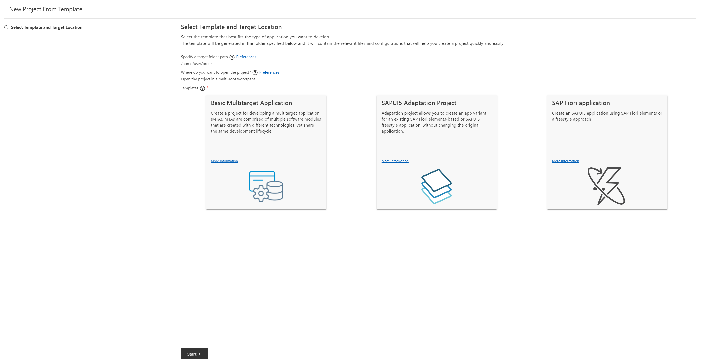
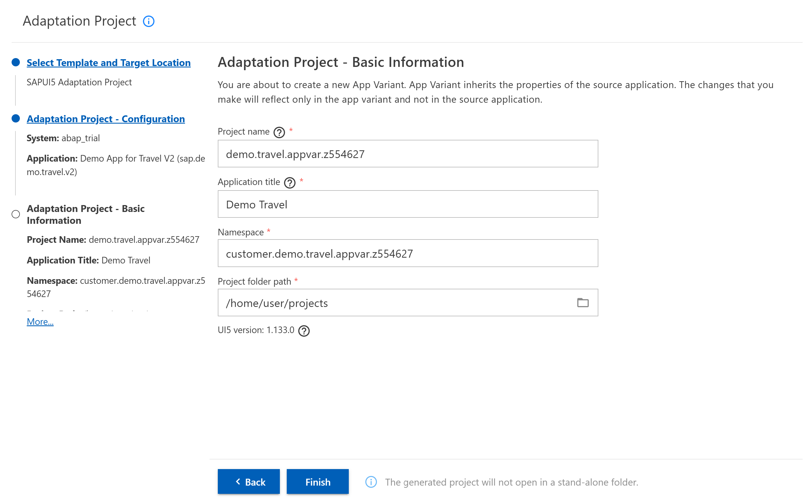
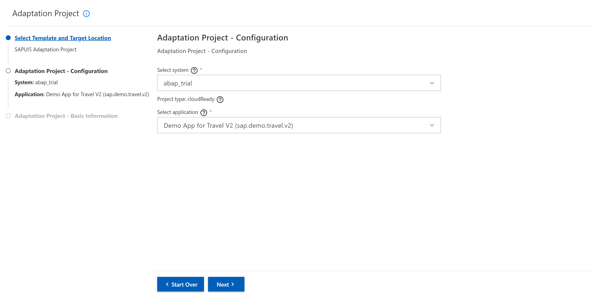
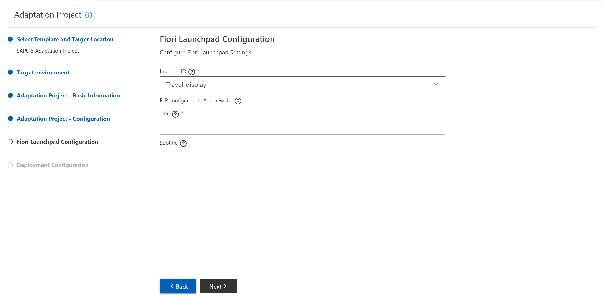
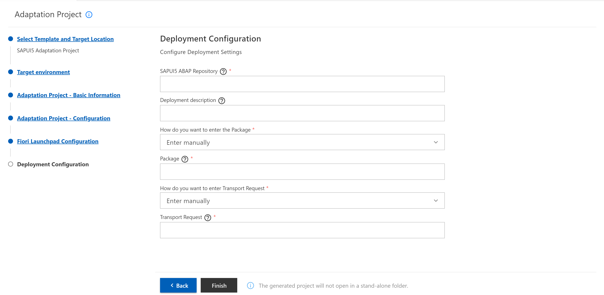

# Chapter 2.0 - Get familiar with SAPUI5 Adaptation Project Generator

By the end of this chapter you will have generated Adaptation Project which will be needed for the upcoming steps.

## Start the Adaptation Project Wizard 
   1. Log onto SAP Business Application Studio (BAS) and access your SAP Fiori development space.

   2. Click the menu icon -> New Project from Template, select SAPUI5 Adaptation Project template, and choose the Start button.

## Create Apdaptation Project
After the wizard is started there are several steps that needs to be completed in order to create Adaptation Project.

### 1. Target Environment

   1. Select ABAP as the target environment in which you want to create your new application variant and choose Next.

### 2. Basic Information

   1. Enter the Basic Information required for your adaptation project:
      - Project Name: uniquely identifiable name "demo.travel.appvar.{your unique number}"
      - Application Title: uniquely identifiable name "Demo Travel {your unique number}"
   2. Press the Next button.

   
### 3. Configuration
   1. Enter the Configuration information required for your adaptation project:
         - From the Select System dropdown list select the system you want to use.
         - From the dropdown list in the Select Application field, choose "Demo App for Travel V2 (sap.demo.travel.v2)" the SAP Fiori application that will be as the basis for your application variant.
         - To enhance the application with additional capabilities and logic, you need to select the No option in answer to Enable Safe Mode?
   2. Press the Next button.
   
   
### 4. Fiori Launchpad Configuration
   
   1. Enter the Fiori Launc Fiori Launchpad Configuration required for your adaptation project:
      - In the Inbound ID field, select the inbound ID from the dropdown list.
      - In the Title field, enter the title of your application variant that is to be displayed on the new tile, the title should ends with your unique number.
      - In the Subtitle field (optional), you can enter the subtitle to be displayed on the new tile.
   2. Press the Next button.
   
   
   
### 5. Deployment Configuration
   1. Enter the Deployment Configuration information required for your adaptation project:
         - Enter a unique SAPUI5 ABAP Repository name.
         - Enter an optional deployment description.
         - Choose how you want to type Package. There are two options. The first one is "Enter manually" and the second one is "Choose from existing", which gives you the ability to choose from the existing packages in your ABAP system.
         - Enter the name of the package in the Package field or search for some existing package in the search field if you choose "Choose from existing" in the above field.
         - Choose how you want to type Transport Request. There are two options. The first one is "Enter manually" and the second one is "Choose from existing", which gives you the ability to choose from the existing Transport Requests in your ABAP system related to the entered Package.
         - Enter the name of your transport request in the Transport Request field or choose it from the dropdown if you choose "Choose from existing" in the above field.
   2. Press the Finish button.

   NOTE: If you had difficulties in creating package and transport request from [Chapter 1.3](/chapters/1.3-create-package-adt/) you can use the following data:
   - Package: Z_UI5CON_HANDSON
   - Transport Request: TRLK911207
  
   
   

As soon as your SAPUI5 Adaptation Project has been created, the following message is displayed “The project has been generated and will be saved for future use.” You can view the adaptation project in your Projects folder and expand the nodes in your workspace.

Continue to [Chapter 3.0 - Get familiar with Control Property Editor!](/chapters/3.0-get-fam-with-cpe/)
