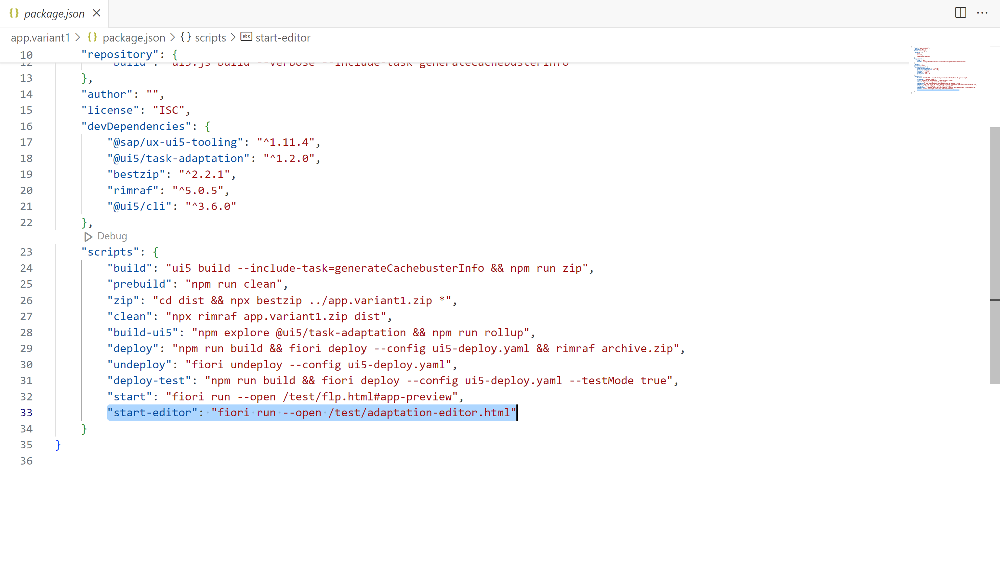
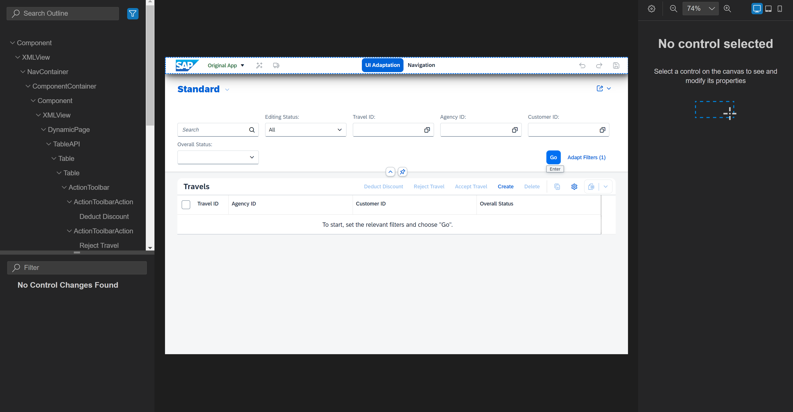

# Chapter 3.0 - Get familiar with Control Property Editor

This chapter is a Lab Preview on the Control Property Editor by the end of if you will get familiar with Control Property Editor. The current tool for such kind of adaptation is Visual Editor, but soon it will be replaced by the Control Property Editor.

## Description

The Control Property Editor is a software tool that allows users to view and modify the properties and attributes of UI controls (like buttons, text fields, and images) within a software application or web page. This editor typically provides an easy-to-use graphical interface where users can adjust settings such as size, color, font, and behavior, enabling customization and fine-tuning of the user interface without the need for extensive coding knowledge.

## Start Control Property Editor

1. Open the package.json from the already created Adaptation Project from [Chapter 2.0](/chapters/2.0-get-fam-with-gen/) and scroll down to "scripts" section.
 

2. Right click on "start-editor" script and then from the opened context menu choose "Run Script". After the execution of the script the Control Property Editor will be opened in a new browser tab.
 

## Components in Control Property Editor

1. Property Editors:
    - Categorized Sections: Properties are organized into categories such as Appearance, Layout, Behavior, and Events. Each category can be expanded or collapsed for easy navigation.
     - Editable Fields: Users can modify properties through various input methods, including text boxes for numerical values, drop-down menus for selecting options, color pickers for color customization, and sliders for adjusting values dynamically.

2. Preview Area: 
    - Real-Time Visualization: As users adjust properties, the changes are immediately reflected in the preview area. This allows users to see the impact of their modifications without needing to save and refresh the entire application.
    - Interactive: Some preview areas may allow direct interaction with the controls, such as resizing or repositioning elements using drag-and-drop functionality.
    
3. Control Selection:
    - Tree View/List: Displays a hierarchical tree view or a flat list of all the UI controls available in the application or page. This makes it easy to navigate and select the control that needs editing.
    - Search Functionality: A search bar to quickly find specific controls by name or type, enhancing the efficiency of the editing process.

4. Changes Area:
    - Panel that shows saved and unsaved changes. 

5. Search and Filter:
    - Tools that enable users to quickly locate specific properties within the Property Grid. Users can enter keywords to search for properties or apply filters based on property names, types, or categories.
    
6. Undo/Redo Functionality:
   - Allows users to reverse or reapply changes made to properties, providing flexibility and enabling easy correction of mistakes.
   
7. Save and Reset Controls: 
   - Provides options for saving changes made to properties or resetting properties to their default values.

Continue to [Chapter 4.0 - Create No Code changes with Control Property Editor](/chapters/4.0-no-code-changes/)
  
