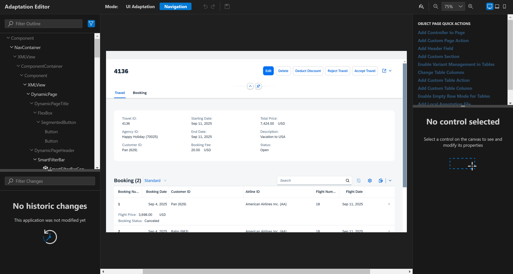
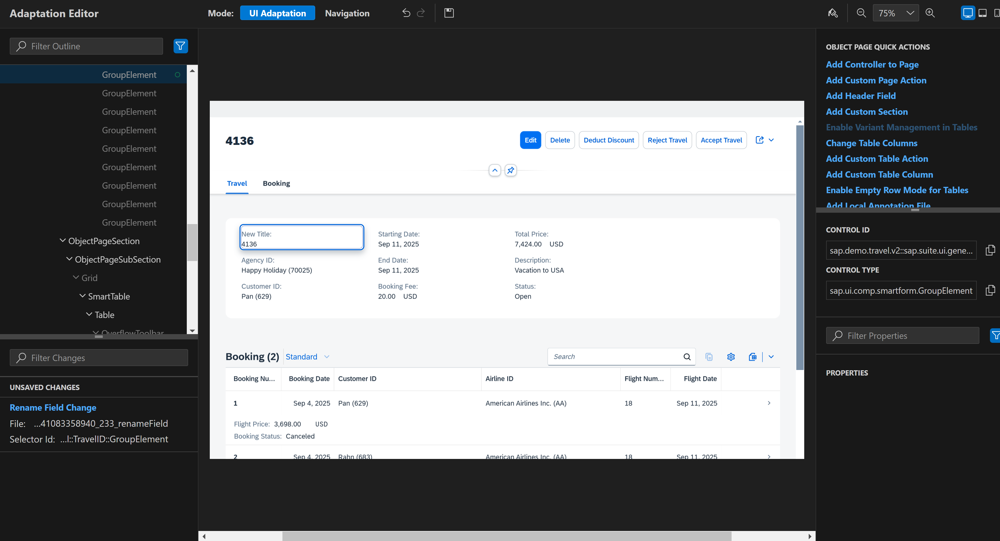
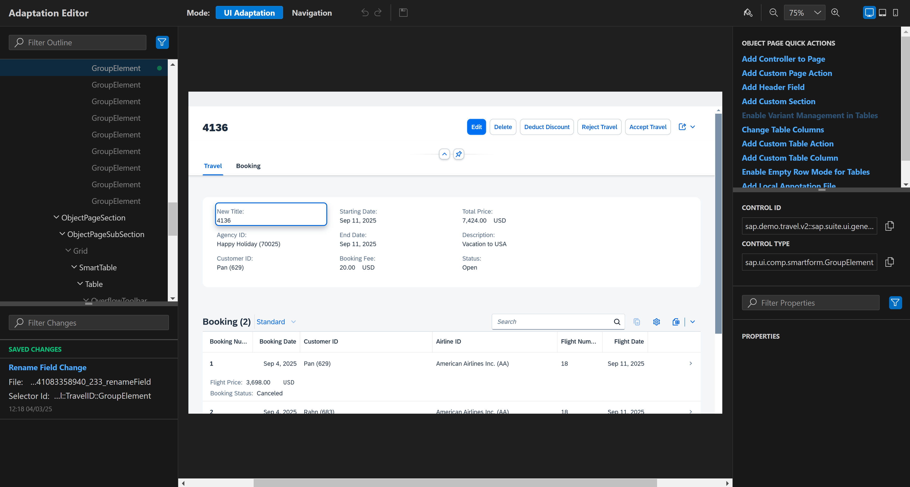
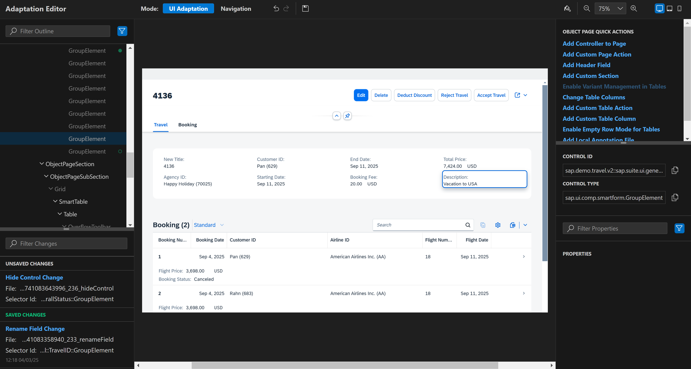
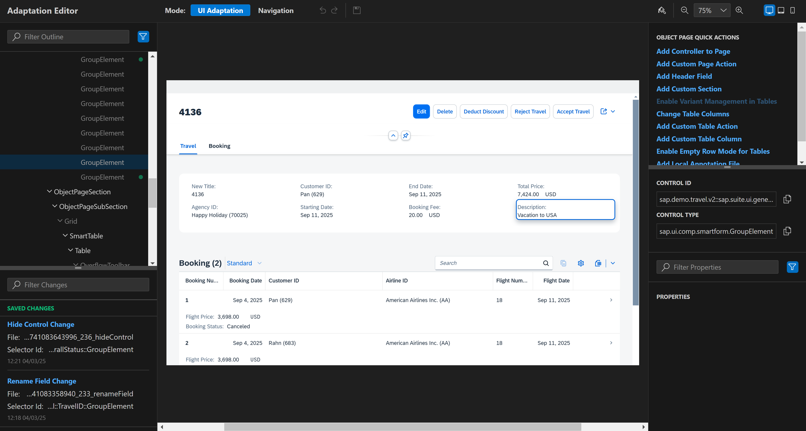
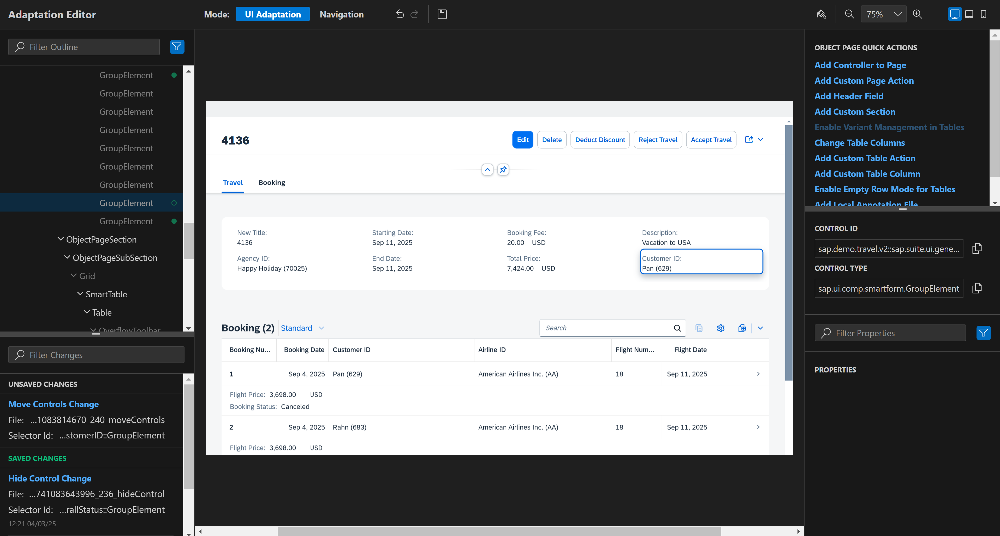
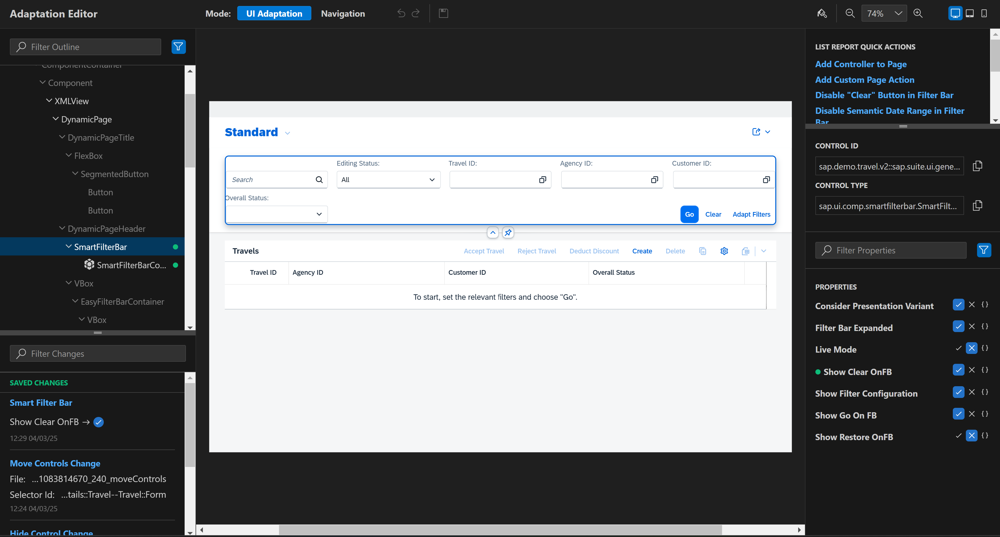

# Chapter 4.0 - Create No Code changes with Control Property Editor

Let's start editing our Adpatation Project from [Chapter 2.0](/chapters/2.0-get-fam-with-gen/)

## Prerequisites
1. Switch to "Navigation" mode - on the top of the opened application there is toolbar menu, click on the "Navigation" button.
2. Go to application Object Page - once you are in "Navigation" mode click on the "Go" button located in the Smart Filter Bar without applying any filters. After your click you should see table with objects then go with your mouse cursor to some of them and click on it as a result you should be navigated to "Object Page" of the application.

## 1. Rename section
   - Switch to "UI Adaptation" mode.
   - Right click on some item from "Travel" section you should see context menu, click on "Rename" item, then the label from the clicked item should be marked and now you are able to rename it, once you rename it press enter. You will see that the label is renamed and unsaved change is shown in changes tab.

   If you want to save your change you should click on "Save" button in the menu toolbar located on the top of the application. Once you do it in changes tab you will see that the status on your unsaved changed has been changed. If you want to see the generated change file you should open "webapp/changes/" folder of your application in BAS.

   
## 2. Remove section
   - Switch to "UI Adaptation" mode.
   - Right click on some item from "Travel" section you should see context menu, click on "Remove" item, then the clicked item should be removed and unsaved change should be shown in changes tab.

   If you want to save your change you should click on "Save" button in the menu toolbar located on the top of the application. Once you do it in changes tab you will see that the status on your unsaved changed has been changed. If you want to see the generated change file you should open "webapp/changes/" folder of your application in BAS.

## 3. Move section
   - Switch to "UI Adaptation" mode.
   - Grab one item from "Travel" section. Аfter moving it to your desired location you will see that unsaved change is created in the changes tab.
   
   If you want to save your change you should click on "Save" button in the menu toolbar located on the top of the application. Once you do it in changes tab you will see that the status on your unsaved changed has been changed. If you want to see the generated change file you should open "webapp/changes/" folder of your application in BAS.
   

## 4. Property change
   - Go to the List Report Page - right click with your mouse somewhere in Control Property Editor browser tab and then from the opened context menu click Back button or refresh Control Property Editor browser tab.
   - Click on the SmartFilterBar. On the properties pane tab you should see all available properties that can be edited for each selected control. In our case let`s edit "Show Clear OnFB" property. Click on the "✓" icon. As a result next to the "Go" button you should see that a new button with text "Clear" is shown. 

If you want to save your change you should click on "Save" button in the menu toolbar located on the top of the application. Once you do it in changes tab you will see that the status on your unsaved changed has been changed. If you want to see the generated change file you should open "webapp/changes/" folder of your application in BAS.
   
   
   Good job you did your first Now code changes. You can play with some other property changes by your own. So let's continue with Variant Management Changes in [Chapter 4.1](/chapters/4.1-variant-man-changes/) 

Continue to [Chapter 4.1 - Do your first Variant Management change!](/chapters/4.1-variant-man-changes/)

 
