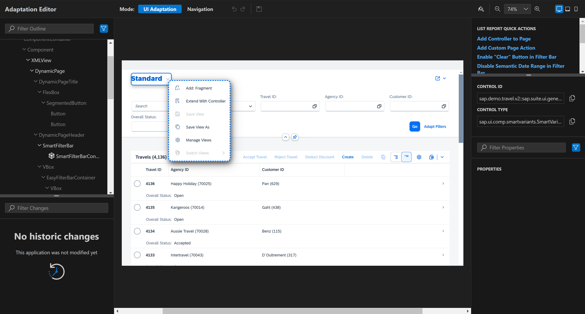
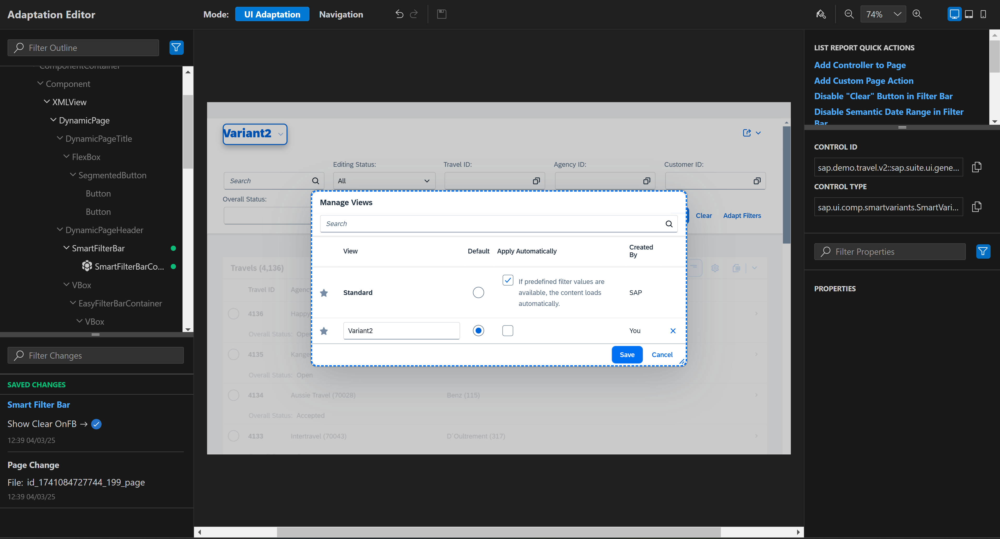
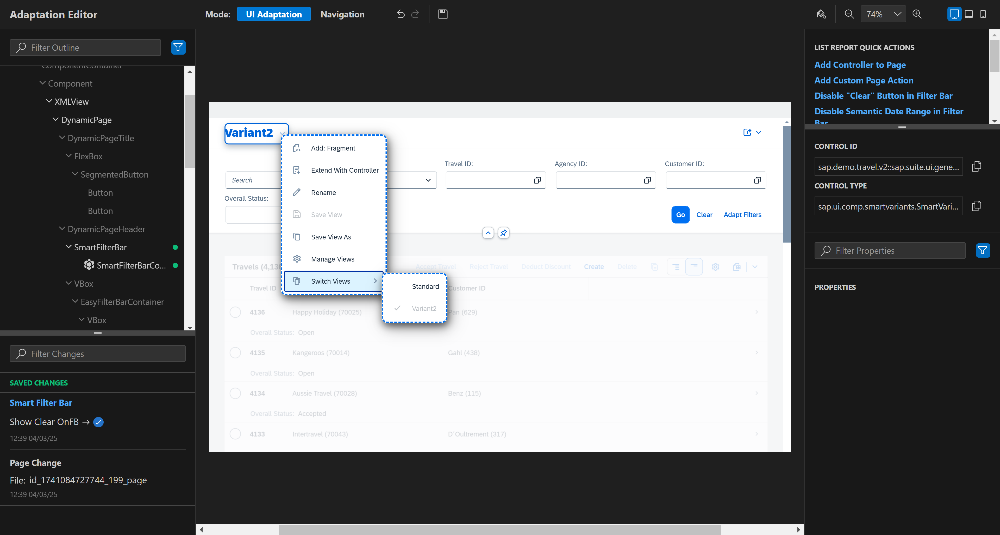

# Chapter 4.1 - Create variant management changes

## Start the Adaptation Editor
   1. Switch to UI Adaptation mode

   2. Right-click the arrow icon next to the application title and select Save View As
 
  
   3. Choose a name for your View (variant) and select would it be default and if it should be applied automatically. Click on Save.
   4. Start making changes - for example do a property change over the FilterBar to show or hide the Clear button - set the property 'Show Clear OnFB' to false or true to hide or show the Clear button next to the Go button. The result of this action is that this change is only added to the Standard variant and not the one you just created.
   5. To manage already created views(variants) right-click the arrow icon next to the application title and select Manage Views. This view gives you the option to changes names or the properties of the already created variants. 

   6. You can switch to another view by right-clicking the arrow icon next to the application title and selecting the Switch Views option that will give you the list of the currenty available views to switch to.
   

   7. You should now switch to the standard variant, because the next type of change only applies to the standard variant.

Continue to [Chapter 4.2 - Do your first add fragement change](/chapters/4.2-fragment-change/)
