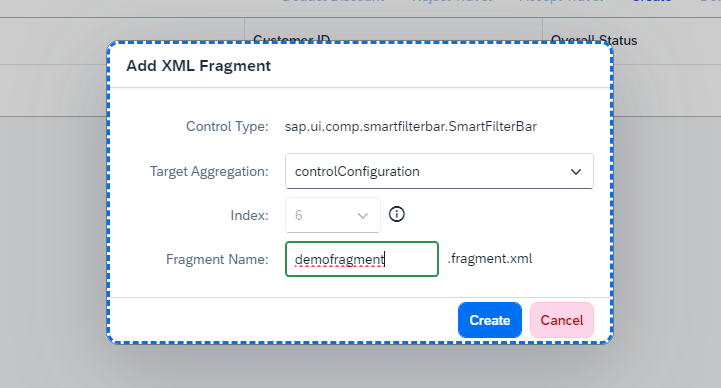
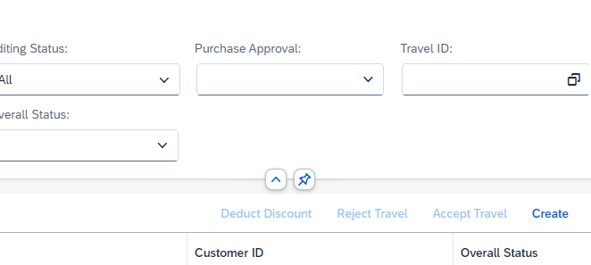

# Chapter 4.2 - Add fragment changes


## Start the Adaptation Editor
   1. Switch to UI Adaptation mode

   2. Right Click over the filter bar and choose Add Fragment. In the popup that appears, select the aggregation that will hold the fragment - ControlConfiguration. Then enter a name for your fragment, e.g. "demofragment". Click on Create - this will create a fragment and a change for it. Click on the SAVE icon in the top right corner of the application view so you can save the change.
 

  
   3. Switch to Business Application Studio and look for the folder called 'fragments' under the 'changes' folder of your projec. Open the fragment file that you just created and replace its contents with this coding:

```
<core:FragmentDefinition xmlns:core='sap.ui.core' xmlns='sap.ui.comp.smartfilterbar' xmlns:m='sap.m'> 
   <ControlConfiguration 
      id="purchaseApproval"
      key="purchaseApproval"
      label="Purchase Approval" 
      visibleInAdvancedArea="true">
      <customControl>
         <m:ComboBox id="purchaseApprovalComboBox">
            <core:Item id="purchaseApprovalComboBoxItem0" key="noApprovalRequired" text="No Approval Required"/>
            <core:Item id="purchaseApprovalComboBoxItem1" key="approvalRequired" text="Approval Required"/>
          </m:ComboBox>
        </customControl>
    </ControlConfiguration>
</core:FragmentDefinition>
```


  Then save the file that you just edited. Go back to the browser tab with the Adaptation Editor and hit the refresh button of the browser. After your have everything loaded again, you should have another custom filter field added to your filterbar.
  
 


Continue to [Chapter 4.3 - Do your first controller extension change](/chapters/4.3-controller-ext-change/)
