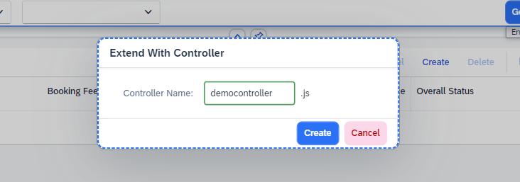
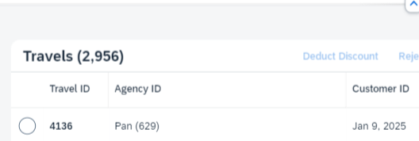

# Chapter 4.2 - Add controller extension changes


## Start the Adaptation Editor
   1. Switch to UI Adaptation mode

   2. Right Click over the main view of the application and choose Extend with Controller from the context menu. Choose a name for your controller in the popup that will show up, e.g. 'democontroller'.
 

  
   3. Switch back to SAP Business Application Studio and look for a folder named 'coding' in the 'changes' folder of the your project. There you should find the just created controller extension. Open the file and replace its contents with :

```
sap.ui.define(
    [
        'sap/ui/core/mvc/ControllerExtension',
        "sap/ui/model/Filter",
        "sap/ui/model/FilterOperator"
    ],
    function (
        ControllerExtension,
        Filter,
        FilterOperator
    ) {
        "use strict";
        var APPROVAL_LIMIT = 15;
        return ControllerExtension.extend("customer.app.variant5.democontroller", {
            override: {
                templateBaseExtension: {
                    addFilters: function (fnAddFilter, sControlId) {
                        var oComboBox = this.byId("purchaseApprovalComboBox");
                        var sSelectedKey = oComboBox.getSelectedKey();
                        var oFilter;
                        switch(sSelectedKey) {
                            case "noApprovalRequired":
                                oFilter = new Filter({
                                    path: "BookingFee",
                                    operator: FilterOperator.LT,
                                    value1: APPROVAL_LIMIT
                                    });
                                break;
                            case "approvalRequired":
                                oFilter = new Filter({
                                    path: "BookingFee",
                                    operator: FilterOperator.GE,
                                    value1: APPROVAL_LIMIT
                                });
                                break;
                            default:
                                break;
                        }

                        if (oFilter){
                            fnAddFilter(this, oFilter);
                        }
                    }
                }
            }
        });
    }
);
```
  
  Make sure you have entered the namespace of your project and the right name of your controller extension file in the markup for that.


   4. After saving all files which were edited switch back to the browser tab with the Adaptation Editor. Refresh the browser tab.
   5. Switch to Navigation mode and press GO so you can load up the data in the table - you will see all the entries added to the table as seen in the count number in the title of the table. Let`s now select one of the values of the newly added filter field, e.g. No Approval Required and then press GO - only entries with value for BookingFee lower then the approval limit set in the coding will be loaded in the table. Also, if you switch the filter to Approval Required and press GO again, only the entries with value for BookingFee higher than the approval limit will be loaded in the table. 




Optionally if you're really fast and want to do more coding - continue to [Chapter 5.0 - Add keys to i18n file](/chapters/5.0-add-keys-in-i18n/).

Or continue to [Chapter 6.0 - Build and deploy your application to SAP BTP, ABAP environment](/chapters/6.0-build-and-deploy/)
