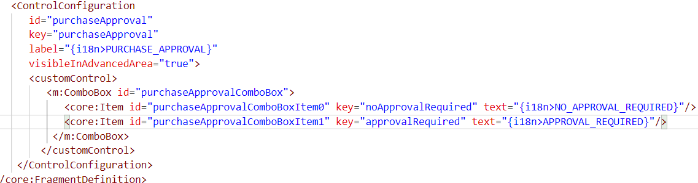
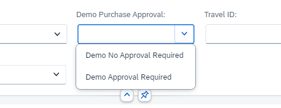

# Chapter 5.0 - Add i18n keys

   1. Go to the main folder of your project, open the folder named i18n, open the file called i18n.properties and add these lines to the file i18n.properties:

PURCHASE_APPROVAL=Demo Purchase Approval

APPROVAL_REQUIRED=Demo Approval Required

NO_APPROVAL_REQUIRED=Demo No Approval Required

   2. Open the fragment file that you have created in the previous chapters and replace the following tags of the field and the selection items in the combobox:

label="Purchase Approval" with label="{i18n>PURCHASE_APPROVAL}"

text="No Approval Required" with text="{i18n>NO_APPROVAL_REQUIRED}"

text="Approval Required" with text="{i18n>APPROVAL_REQUIRED}"

 

   3. Save all changes, go back to the browser tab with the Adaptation Editor and reload the browser tab. Switch to Navigation mode and click the filter item combobox - you will see the new values taken from the i18n file and applied to the filter item.

 
