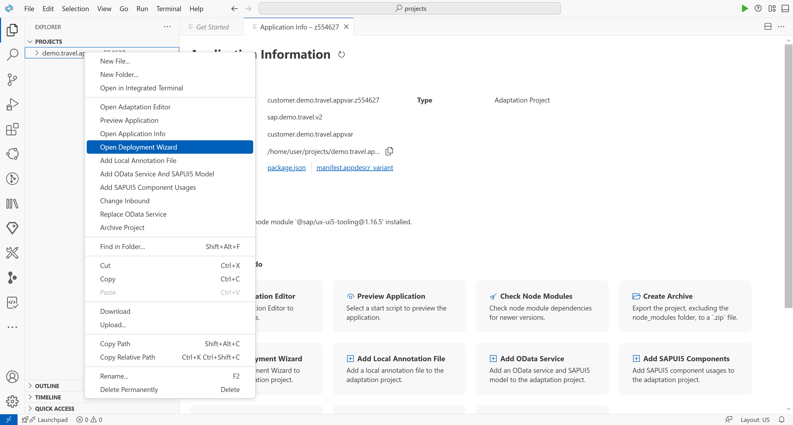
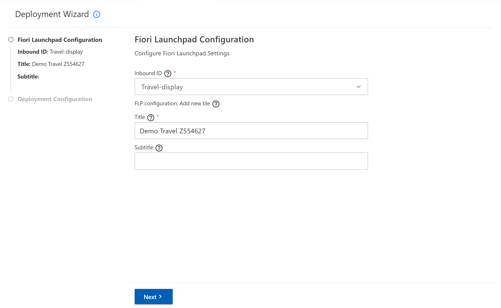
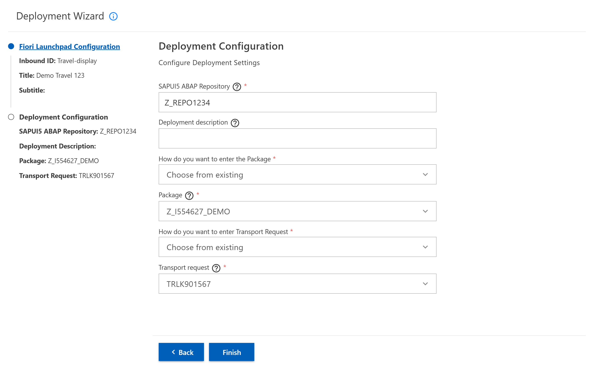
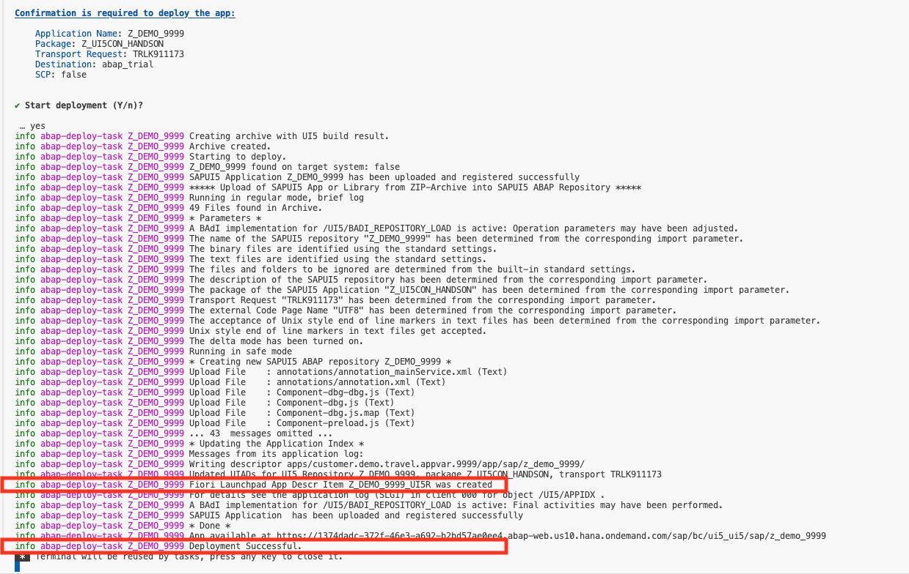

# Chapter 6.0 - Add Fiori Launchpad and Deploy configurations to your SAPUI5 Adaptation Project and deploy to your prepared SAP BTP, ABAP environment

In this chapter you will add Fiori Launchpad and Deploy configurations, build and deploy your SAPUI5 adaptation project to your prepared SAP BTP, ABAP environment.

### 1. Open Deployment Wizard

Open the folder in which the Adaptation Project is generated. When you right click on the Adaptation Project folder you will see a context menu, click on "Open Deployment Wizard" context menu item.



   
### 2. Fiori Launchpad Configuration
   
   1. Enter the Fiori Launc Fiori Launchpad Configuration required for your adaptation project:
      - In the Inbound ID field, select the inbound ID from the dropdown list.
      - In the Title field, enter the title of your application variant that is to be displayed on the new tile, the title should ends with your unique number.
      - In the Subtitle field (optional), you can enter the subtitle to be displayed on the new tile.
   2. Press the Next button.
   
   
   
### 3. Deployment Configuration

   1. Enter the Deployment Configuration information required for your adaptation project:
         - Enter a unique SAPUI5 ABAP Repository name.
         - Enter an optional deployment description.
         - Choose how you want to type Package. There are two options. The first one is "Enter manually" and the second one is "Choose from existing", which gives you the ability to choose from the existing packages in your ABAP system.
         - Enter the name of the package in the Package field or search for some existing package in the search field if you choose "Choose from existing" in the above field.
         - Choose how you want to type Transport Request. There are two options. The first one is "Enter manually" and the second one is "Choose from existing", which gives you the ability to choose from the existing Transport Requests in your ABAP system related to the entered Package.
         - Enter the name of your transport request in the Transport Request field or choose it from the dropdown if you choose "Choose from existing" in the above field.
   2. Press the Finish button.

   

After the you press Finish button, Fiori Launchpad and Deploy configurations will be generated to your SAPUI5 Adaptation Project and deploy process will start.
A new terminal will appear running the deployment operations.
If you check out the deployment in detail you will notice that the it actually executes four commands one after the other:
1. ```npm install ``` - which will install the new added node_modules required for the deployment.
2. ```npm run build``` - which calls the @ui5/cli to build the application, during the build all the sources of the base application are downloaded and merged with the changes of the adaptation project. The results are stored i a newly created 'dist' folder. 
3. ```fiori deploy --config ui5-deploy.yaml``` - which zips the content of the 'dist' folder into the 'archive.zip' and deploys the application via an OData service to your specified backend system
4. ```rimraf archive.zip``` - which deletes the 'archive.zip' that was created during the deployment so that you're left with a clean state.

Now the deployment is taking place, if it was succesful you will get a detailed success massage with everything that went on in the backend. Two important pieces of information are:

1. The successful creation of the Fiori Launchpad App Descr Item
2. "Deployment Successful" message




Continue to [Chapter 7.0 - Run your app in the SAP Fiori launchpad!](/chapters/7.0-configure-flp-with-adt/)
