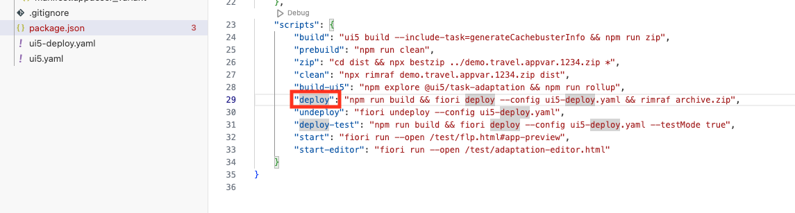
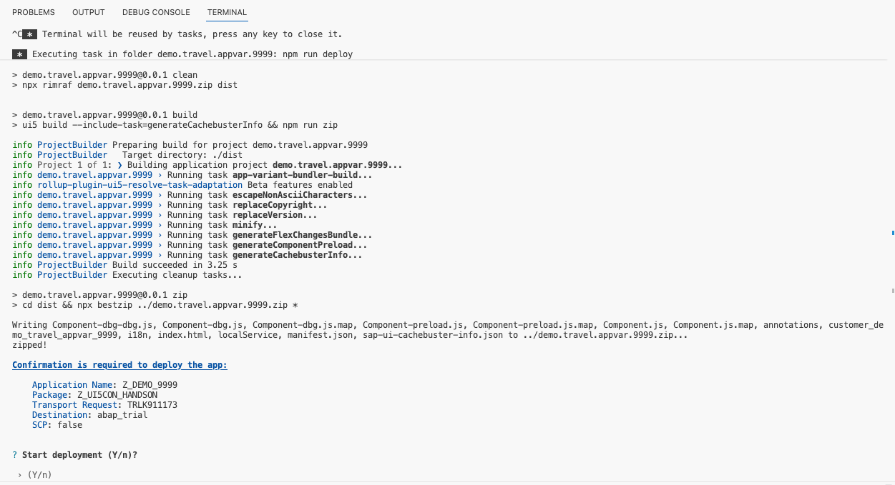
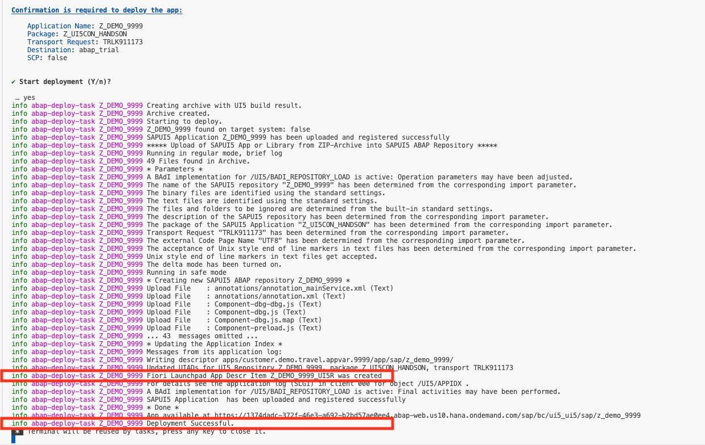

# Chapter 6.0 - Build and Deploy your SAPUI5 Adaptation Project

In this chapter you will build and deploy your SAPUI5 adaptation project to your prepared SAP BTP, ABAP environment.


Open the package.json of your adaptation project and either run the "deploy" script by right clicking on the "deploy" and selecting "Run Script".

Or open a terminal and run ``` npm run deploy ```.



If you check out the command in detail you will notice that the deployment actually executes three commands one after the other:
1. ```npm run build``` - which calls the @ui5/cli to build the application, during the build all the sources of the base application are downloaded and merged with the changes of the adaptation project. The results are stored i a newly created 'dist' folder. 
2. ```fiori deploy --config ui5-deploy.yaml``` - which zips the content of the 'dist' folder into the 'archive.zip' and deploys the application via an OData service to your specified backend system
3. ```rimraf archive.zip``` - which deletes the 'archive.zip' that was created during the deployment so that you're left with a clean state.


Once you run the "deploy" command a terminal will appear running the build command first and stop to wait for your final confimation that you really want to deploy the application. 
In the terminal logs you can also see which tasks are executed during the build of the adaptation project.



Type in "Y" to proceed.

Now the deployment is taking place, if it was succesful you will get a detailed success massage with everything that went on in the backend. Two important pieces of information are:

1. The successful creation of the Fiori Launchpad App Descr Item
2. "Deployment Successful" message




Continue to [Chapter 7.0 - Run your app in the SAP Fiori launchpad!](/chapters/7.0-configure-flp-with-adt/)
