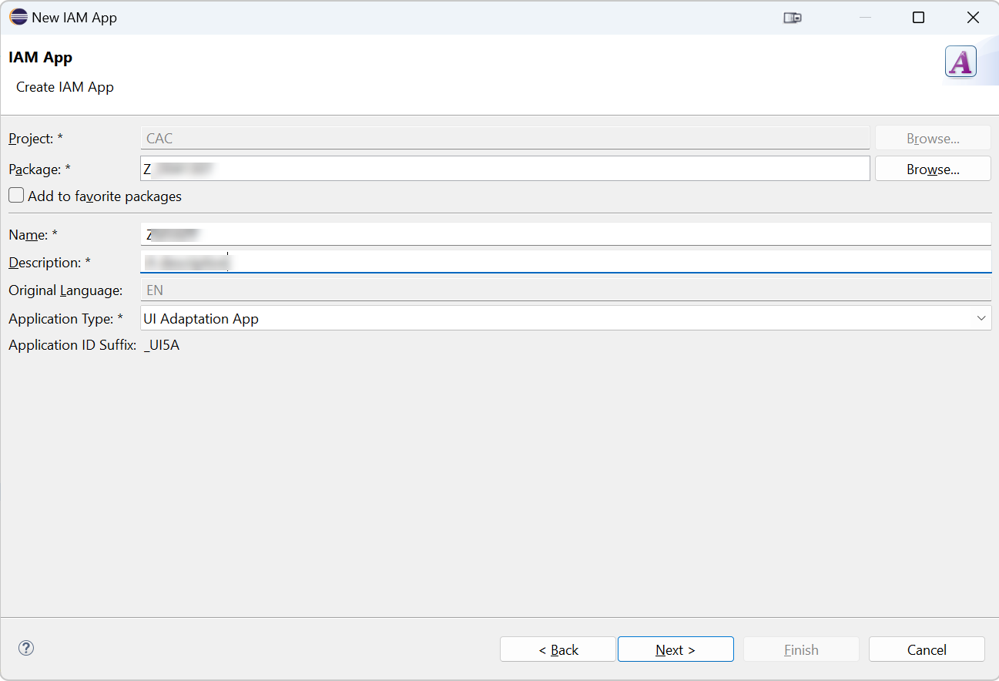

# Add your app to a catalog in ABAP Development Tools

### 1. Refresh your package in ABAP Development tools
In ABAP development tools, locate the package which you have used to deploy your app and refresh the content list.

### 2. Find the new content
You will find some new content created by the deployment:

- A BSP application which is the technical container of the deployed app
- 2 ICF nodes which are used to access the content at runtime
- A Launchpad App Descriptor Item which contains the tile and target mapping that has been defined in the project wizard. It has the same name as the UI5 Repository with the suffix _UI5R

### 3. Create an IAM Application
1. Copy the ID of the Launchpad App Descriptor Item as you will need it.
2. Right click the package and choose **New** > **Other ABAP Repository Object** > **IAM App**.
3. Provide a name and description. You can use the same name as for the UI5 repository
4. Set **Application Type** to **UI Adaptation App**

5. On the next step specify your transport

6. In the IAM App specify the ID of the Launchpad App Descriptor Item

7. Go to **Services** tab and click on **Synchronize**
8. Go to **Authorizations** tab and click on **Synchronize**
9. Go back to **Overview** page and click on **Publish Locally**
10. Click on **Assign the App to an existing Catalog**
11. Enter **ZUI5_CON_ADAPTATIONS** as Business Catalog name
This catalog is already assigned to a business role which is assigned to your user.
12. On the next page specify your transport

Continue to [Chapter 8.0 - Run your application variant in the SAP Fiori launchpad](/chapters/8.0-run-in-flp/)