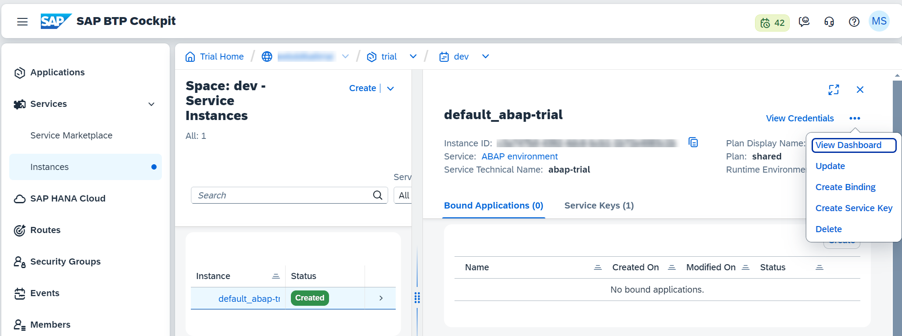
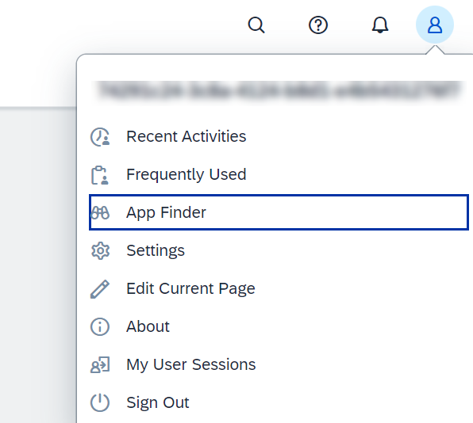
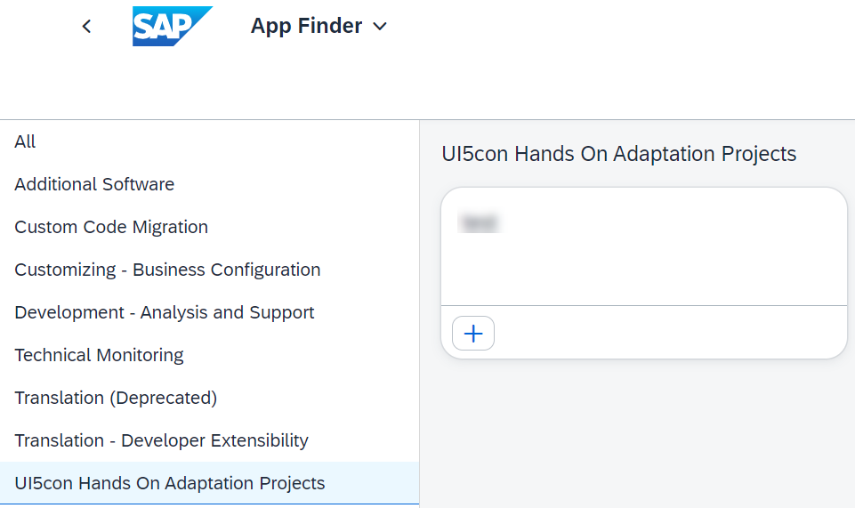

# Find and run your app in the Fiori Launchpad
1. Launch the Launchpad of your trial system.
You can find the URL in the service key or just click the View Dashboard button on the service instance:

2. Go to **Me Area** -> **App Finder**

3. Go to the catalog **UI5con Hands On Adaptation Projects** and locate your app to start it
